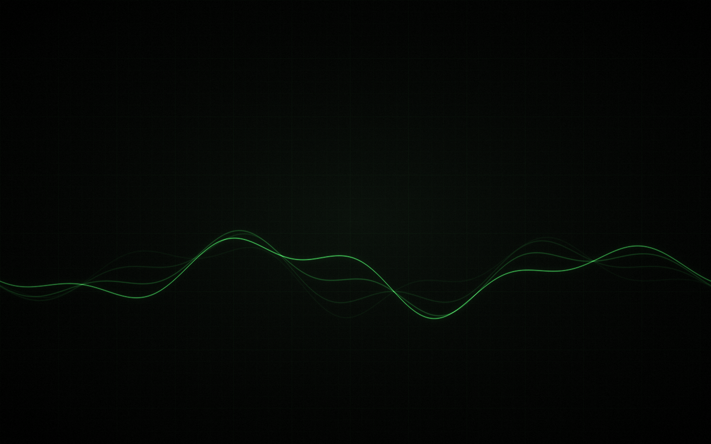

# GreenPhosphor-CRT

A green-phosphor CRT theme for the GNOME desktop — deep green-black grounds, muted phosphor text, subtle glow. Dark, quiet, and retro.

## Screenshots


## What's covered

- GNOME Shell (panel, popups, OSD, Alt-Tab, notifications, overview, lock screen clock)
- GTK3 apps
- GTK4 & libadwaita apps (via `--libadwaita`)
- Tilix color scheme
- Wallpapers (procedurally generated, plus a tool to convert your own)

## Palette

| Role       | Color                        |
| ---------- | ----------------------------- |
| Ground     | `#080B08`                     |
| Window     | `#0C120D`                     |
| Surface    | `#0B140D`                     |
| Phosphor   | `#28A038`                     |
| Bright     | `#33B84A`                     |
| Highlight  | `#3DBF52`                     |
| Selection  | `#28A038` on `#080B08`        |

## Requirements

- GNOME 47/48
- User Themes extension (for the shell theme)
- git
- python3 + numpy + ImageMagick (only for regenerating wallpapers / `crtify.py`)

## Install

```sh
git clone https://github.com/motchalini/greenphosphor-crt.git
cd greenphosphor-crt
./install.sh --libadwaita --tilix
```

Then apply the theme:

```sh
gsettings set org.gnome.desktop.interface gtk-theme 'GreenPhosphor-CRT'
gsettings set org.gnome.desktop.interface color-scheme 'prefer-dark'
gsettings set org.gnome.shell.extensions.user-theme name 'GreenPhosphor-CRT'
```

A re-login is recommended for the login screen and shell theme to fully apply.

## Uninstall

```sh
./install.sh --uninstall
```

## Wallpapers

Two 3840x2400 wallpapers ship in `wallpapers/`: `trace` (an oscilloscope
waveform with phosphor persistence) and `plain` (just the quiet CRT ground).




```sh
mkdir -p ~/.local/share/backgrounds
cp wallpapers/greenphosphor-crt-trace.png ~/.local/share/backgrounds/
gsettings set org.gnome.desktop.background picture-uri \
  "file://$HOME/.local/share/backgrounds/greenphosphor-crt-trace.png"
gsettings set org.gnome.desktop.background picture-uri-dark \
  "file://$HOME/.local/share/backgrounds/greenphosphor-crt-trace.png"
gsettings set org.gnome.desktop.background picture-options 'zoom'
```

Both are generated by `src/wallpaper/generate.py` (numpy + ImageMagick), so
you can re-render at any resolution or variant:

```sh
./src/wallpaper/generate.py --width 2560 --height 1440 --variant plain
```

The shipped files were rendered with:

```sh
./src/wallpaper/generate.py --variant trace --out wallpapers/greenphosphor-crt-trace.png
./src/wallpaper/generate.py --variant plain --out wallpapers/greenphosphor-crt-plain.png
```

### Make your own wallpaper match

`tools/crtify.py` gives any image the same treatment:

```sh
# Sticker-style art on a flat background: key the background out and
# replace it with the CRT ground, keeping the artwork's colors.
./tools/crtify.py input.png output.png --mode flat-bg

# Full green-phosphor monochrome with bloom.
./tools/crtify.py input.png output.png --mode phosphor
```

`--mode flat-bg` samples the background color from the top-left pixel
(override with `--bg '#1F2933'` if needed); images with real transparency
use their alpha channel directly. `--glow-tint 0..1` (default 0.35)
controls how much halos around the artwork are tinted toward phosphor green.

## Phosphor window (an ambient Tilix pane)

`tools/phosphor-window.py` turns an idle terminal pane into a quiet window:
a small landscape outside that follows the real weather and time of day
(sun, the moon in its actual phase, stars, clouds, rain, snow, fog, the odd
flicker of lightning), a wall clock, and a rabbit that lives on the floor
below the window. The rabbit has no needs and nothing to look after; it
naps, grooms, nibbles hay and watches the rain. Python 3 standard library
only; 24-bit green only, and the background is left transparent.

```sh
./tools/phosphor-window.py
```

Run it in a pane, or make it the pane's command (e.g. a Tilix session's
`overrideCommand`). Press `q` (or Ctrl+C) to drop to a shell in the same
pane: as the pane's own command it is replaced by your `$SHELL` (the pane
stays open); started from a prompt, it simply returns to that prompt. Run
`tools/phosphor-window.py` again to bring the window back. Space makes the
rabbit turn to you.

Live weather is optional. Create `~/.config/phosphor-window/config.json`
(this example is Tokyo Station):

```json
{"latitude": 35.681, "longitude": 139.767, "timezone": "Asia/Tokyo"}
```

It then asks [Open-Meteo](https://open-meteo.com/) (no API key) every 20
minutes and caches the answer in `~/.cache/phosphor-window/weather.json`.
Without the file nothing is fetched and the sky stays clear. Network
failures are silent.

| Flag | |
| --- | --- |
| `--once [COLSxROWS]` | print one coloured frame and exit |
| `--dump COLSxROWS` | print one frame as plain text and exit |
| `--weather clear\|clouds\|rain\|snow\|fog\|thunder` | fix the weather (no network) |
| `--time HH:MM`, `--date YYYY-MM-DD` | fix the clock |
| `--offline` | never use the network |
| `--seed N` | fix the landscape and the rabbit's choices |
| `--rabbit sit\|hop\|groom\|eat\|look\|loaf\|sleep\|binky\|flop\|front` | keep the rabbit doing one thing |

Tests: `python3 -m unittest discover -s tests`.

## Goes well with

- Tela green (dark) icon theme
- A monospace font you like (the author uses Cica)
- GNOME accent color "green"
- Dark Style

## Development

`src/overrides/` holds the source CSS. `build.sh` regenerates the built CSS under `themes/` by appending these overrides as marked sections. `src/wallpaper/generate.py` renders the wallpapers (deterministic, fixed seed — the shipped PNGs are byte-reproducible with the commands above); shared palette/math lives in `src/wallpaper/crtlib.py`, also used by `tools/crtify.py`.

## Credits & License

Based on [Graphite GTK theme](https://github.com/vinceliuice/Graphite-gtk-theme) by vinceliuice (GPL-3.0). This theme is also licensed under GPL-3.0. The Tilix color scheme is original work.
